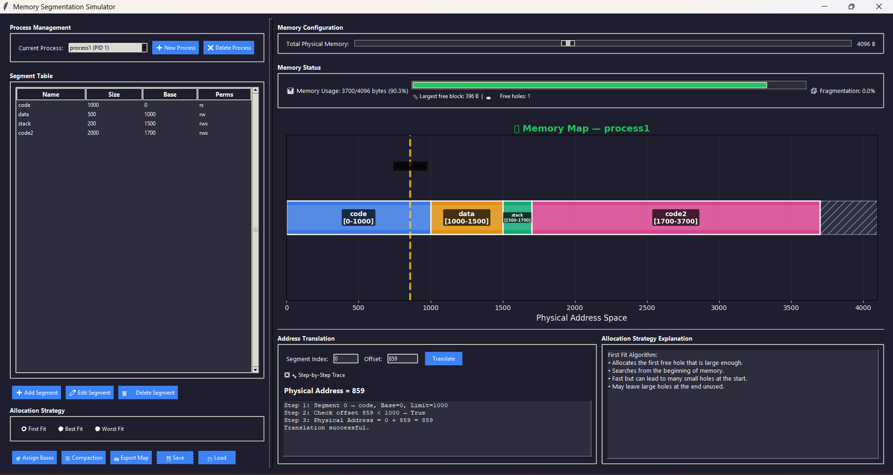

```
███╗   ███╗███████╗███╗   ███╗ ██████╗ ██████╗ ██╗   ██╗
████╗ ████║██╔════╝████╗ ████║██╔═══██╗██╔══██╗╚██╗ ██╔╝
██╔████╔██║█████╗  ██╔████╔██║██║   ██║██████╔╝ ╚████╔╝
██║╚██╔╝██║██╔══╝  ██║╚██╔╝██║██║   ██║██╔══██╗  ╚██╔╝
██║ ╚═╝ ██║███████╗██║ ╚═╝ ██║╚██████╔╝██║  ██║   ██║
╚═╝     ╚═╝╚══════╝╚═╝     ╚═╝ ╚═════╝ ╚═╝  ╚═╝   ╚═╝

███████╗███████╗ ██████╗███╗   ███╗███████╗███╗   ██╗████████╗ █████╗ ████████╗██╗ ██████╗ ███╗   ██╗
██╔════╝██╔════╝██╔════╝████╗ ████║██╔════╝████╗  ██║╚══██╔══╝██╔══██╗╚══██╔══╝██║██╔═══██╗████╗  ██║
███████╗█████╗  ██║  ███╗██╔████╔██║█████╗  ██╔██╗ ██║   ██║   ███████║   ██║   ██║██║   ██║██╔██╗ ██║
╚════██║██╔══╝  ██║   ██║██║╚██╔╝██║██╔══╝  ██║╚██╗██║   ██║   ██╔══██║   ██║   ██║██║   ██║██║╚██╗██║
███████║███████╗╚██████╔╝██║ ╚═╝ ██║███████╗██║ ╚████║   ██║   ██║  ██║   ██║   ██║╚██████╔╝██║ ╚████║
╚══════╝╚══════╝ ╚═════╝ ╚═╝     ╚═╝╚══════╝╚═╝  ╚═══╝   ╚═╝   ╚═╝  ╚═╝   ╚═╝   ╚═╝ ╚═════╝ ╚═╝  ╚═══╝

  ┌──────────┬──────────┬──────────┬──────────┬──────────┐
  │  CODE    │  DATA    │  STACK   │  HEAP    │  [FREE]  │
  │  base=0  │ base=512 │ base=768 │ base=900 │          │
  └──────────┴──────────┴──────────┴──────────┴──────────┘
        Physical Address Space  ──────────────────────────▶
                    S I M U L A T O R   v2.0  |  Python + Tkinter
```

# 🧠 Memory Segmentation Simulator

A desktop application that lets you interactively explore **memory segmentation** — a core operating systems concept. Create processes, define segments, assign base addresses using classic allocation strategies, perform address translation, and watch the memory map update in real time.

Built with Python + Tkinter + Matplotlib, styled with a sleek dark theme.

---

## 🖼️ Screenshot



---

## ✨ Features

- **Multi-Process Management** — Create and switch between multiple processes, each with its own segment table
- **Segment CRUD** — Add, edit, and delete segments with custom names, sizes, and `rwx` permissions
- **Allocation Strategies** — Choose between *First Fit*, *Best Fit*, and *Worst Fit* for base address assignment
- **Strategy Explanation Panel** — Live description of the selected allocation algorithm shown alongside the memory map
- **Memory Compaction** — Collapse all segments to remove fragmentation in one click
- **Dynamic Memory Sizing** — Slider to configure total physical memory from 1 KB to 8 KB on the fly
- **Live Memory Map** — Matplotlib visualization embedded in the UI; updates on every change with a flash animation on assignment
- **Hover Tooltips** — Hover over any segment bar to see its name, size, base address, and permissions in a pop-up
- **Address Translation** — Enter a `(segment index, offset)` pair and get the physical address, or trigger a segmentation fault
- **Step-by-Step Trace Mode** — Walk through every step of the address translation logic
- **Enhanced Memory Stats** — Real-time usage %, external fragmentation metric, largest free block size, and free hole count
- **Export Memory Map** — Save the current memory map visualization as a PNG image
- **Save / Load** — Persist process + segment state to timestamped JSON files in `data/`

---

## 📁 Project Structure

```
segmentation_simulator/
├── main.py               # Entry point — creates Tk root and launches UI
├── ui.py                 # SegmentationSimulatorUI — all Tkinter widgets & logic
├── memory_manager.py     # MemoryManager — base assignment, compaction, free-hole tracking
├── models.py             # Segment & Process data classes with JSON serialization
├── visualization.py      # Standalone matplotlib helper (used for standalone plots)
├── utils.py              # save_processes / load_processes helpers
├── requirements.txt      # Python dependency list
├── data/                 # Auto-created; stores saved session JSON files
├── .gitignore
└── Readme.md
```

---

## 🚀 Getting Started

### Prerequisites

- Python 3.9+
- pip

### Installation

```bash
# Clone the repository
git clone https://github.com/<your-username>/segmentation-simulator.git
cd segmentation-simulator/segmentation_simulator

# Create and activate a virtual environment (recommended)
python -m venv venv

# Windows
venv\Scripts\activate

# macOS / Linux
source venv/bin/activate

# Install dependencies
pip install -r requirements.txt
```

> Tkinter ships with the standard Python installer on Windows. If you are on Linux and it's missing, run `sudo apt install python3-tk`.

### Run

```bash
python main.py
```

---

## 🖥️ UI Layout

The application uses a **resizable split-pane layout**:

| Panel | Contents |
|-------|----------|
| **Left** | Process selector, Segment table, Segment actions, Allocation strategy picker |
| **Right (top)** | Memory configuration slider, Memory status gauge, Live memory map |
| **Right (bottom)** | Address Translation panel *(left)* + Strategy Explanation panel *(right)* |

---

## 🖱️ Usage Walkthrough

### 1. Create a Process
Click **➕ New Process** and enter a name. A fresh process with an empty segment table is created.

### 2. Add Segments
Click **➕ Add Segment**, fill in:
| Field | Example | Notes |
|-------|---------|-------|
| Name | `Code` | Any label |
| Size (bytes) | `512` | Must be > 0 |
| Permissions | `rx` | Any combination of `r`, `w`, `x` |

### 3. Configure Memory Size *(new)*
Use the **Total Physical Memory** slider in the *Memory Configuration* panel to set the physical address space (1024 – 8192 bytes). The memory map and hole calculations update instantly.

### 4. Assign Base Addresses
Choose a strategy from the **Allocation Strategy** panel, then click **🎯 Assign Bases**. The simulator places every segment into physical memory using that strategy, flashes the map, and shows a confirmation. The **Allocation Strategy Explanation** panel always displays a description of the active algorithm.

| Strategy | Behaviour |
|----------|-----------|
| First Fit | Picks the first hole large enough |
| Best Fit | Picks the smallest hole that fits |
| Worst Fit | Picks the largest available hole |

### 5. Hover for Segment Details *(new)*
Move your mouse over any coloured bar in the memory map to see a tooltip with:
- Segment name
- Size (bytes)
- Base address
- Permissions

### 6. Translate an Address
In the **Address Translation** panel:
1. Enter a **Segment Index** (0-based, matching the segment table row)
2. Enter an **Offset** (must be < segment size)
3. Click **Translate**

Enable **🐾 Step-by-Step Trace** to see each translation step logged in detail.

### 7. Compact Memory
Click **🔄 Compaction** to slide all segments together starting at address 0, eliminating external fragmentation.

### 8. Export Memory Map *(new)*
Click **📸 Export Map** to save the current memory map visualization as a PNG file via a save-file dialog.

### 9. Save / Load Sessions
- **💾 Save** — dumps the current state to `data/segments_YYYYMMDD_HHMMSS.json`
- **📂 Load** — opens a file picker to restore any saved session

---

## 📊 Memory Status Panel

| Metric | Description |
|--------|-------------|
| Memory Usage | Bytes used / total, shown as a progress bar and percentage |
| Fragmentation | External fragmentation as a percentage `(1 - largest_hole / free) × 100` |
| Largest Free Block | Size of the biggest contiguous free region |
| Free Holes | Total count of free (unallocated) holes |

---

## 🗂️ Data Format

Saved JSON files follow this schema:

```json
[
  {
    "pid": 1,
    "name": "MyProcess",
    "segments": [
      { "name": "Code",  "size": 512, "permissions": "rx",  "base": 0   },
      { "name": "Data",  "size": 256, "permissions": "rw",  "base": 512 },
      { "name": "Stack", "size": 128, "permissions": "rwx", "base": 768 }
    ]
  }
]
```

---

## 🏗️ Architecture Overview

```
main.py
  └── SegmentationSimulatorUI (ui.py)
        ├── MemoryManager (memory_manager.py)
        │     ├── assign_bases(strategy)   ← First/Best/Worst Fit
        │     ├── compact(segments)
        │     └── reset_holes(segments)
        ├── Process / Segment (models.py)
        │     └── to_dict / from_dict      ← JSON persistence
        └── utils.py                        ← save_processes / load_processes
```

---

## 🛠️ Tech Stack

| Layer | Technology |
|-------|-----------|
| GUI | Tkinter (ttk) |
| Visualization | Matplotlib (embedded via `FigureCanvasTkAgg`) |
| Serialization | Python `json` stdlib |
| Language | Python 3.9+ |

---

## 📝 License

This project is released under the [MIT License](LICENSE).

---

## 🙋 Contributing

Pull requests are welcome. For major changes, please open an issue first to discuss what you'd like to change.
